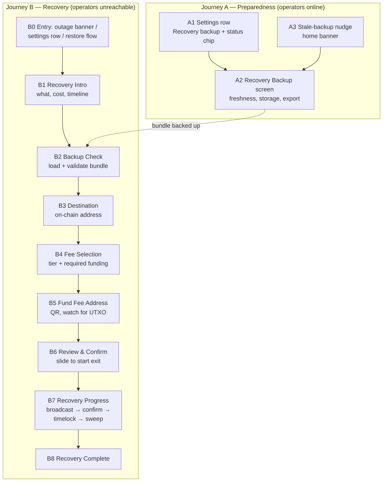

# Blink Mobile UX Flow: Spark Unilateral-Exit Recovery

**Status:** Proposed screen flow for design
**Updated:** 2026-07-06
**Audience:** Product design + mobile engineering
**Builds on:** [mobile-integration-plan.md](mobile-integration-plan.md) and the
[recovery flow diagram](../README.md#recovery-flow)

## Product framing

Unilateral exit is the emergency path for moving self-custodial Spark funds to
a plain on-chain Bitcoin address when Spark operators are unreachable. The UX
splits into two journeys:

- **Journey A — Preparedness** runs continuously while everything is healthy.
  The app keeps an encrypted recovery bundle fresh and backed up. The user
  mostly never sees it; when they do, it is a reassurance surface, not a task.
- **Journey B — Recovery** is the emergency flow. It is rare, high-stakes,
  slow (days to weeks), and must work without any Blink or Spark backend —
  only the user's device and the Bitcoin network.

Product rules the design must hold (agreed in
[blink-wip#807](https://github.com/blinkbitcoin/blink-wip/issues/807), same
model as Bark/Second's backup docs):

1. **Seed restores keys only; the bundle restores recoverable state.** Without
   a bundle saved while operators were online, offline recovery is impossible
   even with a perfect seed backup. The bundle is required wallet state, not
   an optional convenience.
2. **Amounts are "recoverable from this backup", never "your balance".** Every
   estimate shows the bundle timestamp. A stale bundle may recover less than
   the last displayed balance, and funds received after the last refresh may
   be unrecoverable.
3. **Dollar (USD) balance is not covered.** The Bitcoin unilateral-exit path
   recovers Bitcoin leaves only. Any Dollar balance is shown as detected but
   not recoverable via this flow.
4. **Recovery is a multi-week, resumable process, not a transaction.** Fresh
   leaves carry a ~2,000-block (~2 week) timelock between broadcasting the
   exit and sweeping funds. The design centers on a persistent progress
   surface plus notifications, and every step survives app restarts.
5. **Small balances may be uneconomic to recover.** Practical floor is roughly
   10,000 sats per leaf at 1 sat/vbyte, scaling with fee rate. The UX warns
   near the floor and requires explicit advanced confirmation below it.

## Flow overview

Mapping to the CLI/adapter phases in the
[recovery flow diagram](../README.md#recovery-flow):

| Screen | Adapter/CLI phase |
| --- | --- |
| A2 Recovery Backup | `refresh-bundle` (Rust exporter path for Blink) |
| B2 Backup Check | bundle decrypt + validate + `plan` (dry) |
| B3 Destination | destination validation |
| B4 Fee Selection | fee-rate input, `cpfp-address` `requiredSats` estimate |
| B5 Fund Fee Address | `cpfp-address` + `watch-cpfp` |
| B6 Review & Confirm | `plan` (final) |
| B7 Recovery Progress | `package` → `sign-packages` → `broadcast` → `tx-status` → `sweep` → `broadcast-sweep` |
| B8 Recovery Complete | destination outputs confirmed |

---

## Journey A — Preparedness

### A1. Settings row: "Recovery backup"

- **Where:** Settings → Security & Privacy group, visible only in
  self-custodial mode (same gating pattern as "View backup phrase").
- **Elements:** title, one-line subtitle ("Extra protection if Blink services
  become unavailable"), status chip: `Backed up` / `Out of date` / `Not set
  up`, chevron to A2.
- **States:** the chip mirrors adapter states `bundleFresh` / `bundleStale` /
  `bundleMissing`.

### A2. Recovery Backup screen

- **Purpose:** single reassurance-and-control surface for the recovery bundle.
- **Elements:**
  - Status hero: icon + "Recovery backup up to date", last refreshed
    timestamp, amount covered ("Covers 123,456 sats as of Jul 6, 14:02").
  - Storage destination row: iCloud / Google Drive / manual file export —
    reuses the existing cloud-backup destination choices; the bundle rides the
    same rails as the seed backup but is a separate encrypted object.
  - Actions: "Refresh now", "Export backup file" (share sheet), "How recovery
    works" (educational sheet summarizing Journey B, cost, and timeline).
  - Dollar-balance note when a USD balance exists: "Your Dollar balance is not
    covered by on-chain recovery."
- **States:** fresh / stale (warning banner + prominent Refresh) / missing
  (setup-style empty state) / refresh in progress / refresh failed (operators
  unreachable → link to "Recover funds" entry B0).
- **Design note:** refresh is automatic after every balance-changing event;
  this screen exists for transparency and manual export, not as a chore.

### A3. Stale-backup nudge

- **Where:** home screen banner, same pattern as the existing backup nudge and
  unclaimed-deposit banner.
- **Trigger:** bundle stale beyond threshold or missing while balance > 0.
- **Action:** opens A2. Dismissible, but returns while the condition holds.

---

## Journey B — Recovery

### B0. Entry points

1. **Outage banner (primary):** when the app detects Spark operators
   unreachable while the network is otherwise fine, the home screen shows a
   persistent warning banner: "Blink self-custodial services are unreachable.
   Your funds are safe — you can recover them on-chain." → B1.
2. **Settings row (always available):** Settings → "Recover funds on-chain
   (advanced)" so the user never depends on outage detection.
3. **Restore flow branch:** after seed restore on a new device, if wallet
   initialization cannot reach operators, offer "Recover on-chain from a
   backup" instead of a dead-end error.
4. **Resume card:** if a recovery session is already in progress, all entry
   points route to B7 (progress) instead of B1.

### B1. Recovery Intro

- **Purpose:** set expectations before any input; this is the informed-consent
  screen.
- **Elements:**
  - Icon hero + headline: "Recover your funds on-chain".
  - Numbered explainer (3–4 steps): check your recovery backup → send a small
    fee amount → confirm → wait for funds at your address.
  - Expectation callouts (must be unmissable):
    - **Time:** "Takes about 2 weeks to complete. You can close the app —
      we'll notify you at each step."
    - **Cost:** "On-chain fees apply. Small balances may not be worth
      recovering."
    - **Needs:** "Your recovery backup, a Bitcoin address to receive funds,
      and a small amount of on-chain bitcoin for fees (from an exchange or
      another wallet)."
  - Primary CTA: "Start recovery check" (non-destructive — nothing is
    broadcast for several screens). Secondary: "Contact support".
- **Design note:** tone is calm and factual, not alarmist. The user is likely
  stressed; the screen's job is to convert panic into a checklist.

### B2. Backup Check

- **Purpose:** locate, decrypt, and validate the recovery bundle; show what is
  actually recoverable.
- **Sources (in order):** automatic from the configured cloud backup → local
  app copy → manual import (Files picker / paste / QR scan of an exported
  bundle).
- **Elements on success:**
  - Result card: "Recoverable from this backup: 123,456 sats", bundle
    timestamp ("Backup from Jul 6, 14:02"), leaf count as plain language
    ("3 recoverable outputs"), network badge.
  - Freshness verdict: fresh (quiet confirmation) vs stale (warning banner:
    "This backup is N days old. Funds received after this date can't be
    recovered, and some shown funds may already have moved.").
  - Dollar-balance warning when the bundle records a USD balance: "Dollar
    balance (X USD) is not recoverable through this flow."
  - Near/below economic floor: warning or blocking state per product rule 5;
    below floor requires an explicit "Recover anyway (advanced)" confirmation.
- **Error states** (each with a next action, never a dead end):
  - `bundle-invalid` → "This file isn't a valid recovery backup" + re-import.
  - `bundle-seed-mismatch` → "This backup belongs to a different wallet" +
    re-import / check seed.
  - `no-recoverable-leaves` → "This backup contains no recoverable funds" +
    explanation + support link.
  - No bundle found anywhere → educational dead-end state: "Without a recovery
    backup we can't recover funds while Blink services are down" + retry
    import + support link. This state is why Journey A exists.
- **CTA:** "Continue" (enabled on a valid, acknowledged bundle).

### B3. Destination

- **Purpose:** collect the on-chain Bitcoin address that will receive the
  recovered funds.
- **Elements:** address field with paste + QR scan (reuse the send-flow
  destination screen pattern), address validation for the bundle's network,
  contextual help: "Use an address from a wallet you control — a hardware
  wallet or another mobile wallet. Avoid exchange addresses for recovery."
- **Warning:** if the address came from a QR scan, show the standard
  confirm-destination treatment; a typo here sends recovered funds into the
  void.
- **CTA:** "Continue".

### B4. Fee Selection

- **Purpose:** choose the fee rate for the exit packages; derive the required
  fee-funding amount.
- **Elements:**
  - Fee tier selector (reuse the send-flow fee-tier component): economy /
    standard / priority with sat/vB and a plain-language time hint. Tiers come
    from the chain service (Esplora recommended fees), not Blink's backend.
  - Derived line, updating with the tier: "You'll need to send ~N sats
    (~$X) to a temporary fee address in the next step."
  - Info note: "Fees pay Bitcoin miners to process your recovery. Leftover fee
    funds are included in what you get back." (change chains through the
    packages; the final sweep pays to the destination).
- **CTA:** "Continue".

### B5. Fund Fee Address

- **Purpose:** the user sends the required fee amount from any external source
  (exchange, another wallet); the app watches for it.
- **Elements:**
  - Amount required, large and copyable: "Send at least N sats".
  - Funding address as QR + copy button (derived from the wallet seed — no
    extra key to back up; say so: "This address belongs to your wallet").
  - Source suggestions: "Send from an exchange or any other Bitcoin wallet."
  - Watch state (auto-advancing): waiting for payment → payment seen in
    mempool → confirmed (1 conf). Reuse the receive-screen paid/pending
    treatment.
  - Underfunded state (`fee-funding-underfunded`): "You sent M sats but N are
    needed. Send at least the difference to the same address."
- **Behavior:** safe to background the app; a local notification fires when
  funding confirms. The screen resumes into the correct state.
- **CTA:** none required — auto-advances to B6 on confirmation ("Continue"
  appears when funded).

### B6. Review & Confirm

- **Purpose:** the single point of commitment before anything is broadcast.
- **Elements:**
  - Summary card: recoverable amount (labeled "from backup dated …"),
    destination address, estimated total fees (packages + CPFP + sweep),
    estimated net amount, expected timeline ("about 2 weeks").
  - Re-shown warnings if applicable: stale backup, Dollar balance not
    included, near-floor economics.
  - Consequence note: "This broadcasts your exit to the Bitcoin network. It
    can't be undone, and your Spark balance will be moved on-chain."
  - Confirm control: slide-to-confirm (same slider as high-stakes send).
- **CTA:** slider "Slide to start recovery".

### B7. Recovery Progress

- **Purpose:** the long-lived home for the recovery session; the app's most
  important screen for the next ~2 weeks. Reachable from a persistent home
  card and notifications; survives restarts (all state is persisted and
  re-derived from chain lookups).
- **Layout:** vertical stepper of phases, each with status, timestamp, and an
  expandable per-output detail:
  1. **Broadcasting exit transactions** — per-leaf package submission;
     progress "2 of 3 broadcast". Errors here (`broadcast-rejected`) surface
     inline with retry; other leaves continue.
  2. **Waiting for confirmations** — per-leaf confirmation count.
  3. **Timelock — funds locked until ~date** — the headline element of this
     screen: a countdown in blocks and an estimated calendar date ("~9 days
     left, est. Jul 20"). Per leaf, since timelocks differ. Copy explains:
     "Bitcoin enforces a waiting period on this type of recovery. Nothing is
     wrong — your funds are locked to your keys and no one else can move
     them."
  4. **Sweeping to your address** — sweep broadcast + confirmation per leaf.
  5. **Done** — links each swept txid to a block explorer.
- **Global elements:** total recovered-so-far vs expected; "You can close the
  app — we'll notify you at every step" reassurance; notification opt-in
  prompt on first visit if not granted; support link with an exportable
  diagnostic summary (txids, phases — no secrets).
- **Partial completion:** if some leaves complete and others fail, the screen
  stays honest: recovered amount, failed amount, per-leaf error, retry per
  leaf (`partiallyComplete`).
- **Design note:** this screen is where trust is won. Every state must answer
  "is something wrong?" and "what happens next, when?".

### B8. Recovery Complete

- **Purpose:** closure and verification.
- **Elements:** success hero, total recovered and destination address,
  explorer links per sweep transaction, partial-recovery summary when
  applicable ("123,000 sats recovered; 4,000 sats in 1 output could not be
  recovered — details"), guidance on next steps ("Your funds are now in your
  on-chain wallet. This Blink wallet no longer holds a Spark balance.").
- **CTA:** "Done".

---

## Error dictionary

Adapter failure classes → surface and message intent. Every error state names
what happened, whether funds are at risk, and the next action.

| Failure class | Surfaces on | Message intent | Next action |
| --- | --- | --- | --- |
| `bundle-invalid` | B2 | Not a valid backup file | Re-import |
| `bundle-stale` | B2, B6 | Warning, not blocker: amounts may differ | Acknowledge |
| `bundle-seed-mismatch` | B2 | Backup belongs to another wallet | Re-import / check seed |
| `no-recoverable-leaves` | B2 | Backup holds no recoverable funds | Support |
| `below-economic-floor` | B2, B6 | Recovery costs more than it returns | Advanced confirm or stop |
| `fee-input-missing` / `fee-input-insufficient` | B5 | Fee funding not there yet / too small | Keep waiting / top up |
| `fee-funding-underfunded` | B5 | Sent less than required | Top up same address |
| `package-construction-failed` | B7 step 1 | Technical failure, funds untouched | Retry / support |
| `broadcast-rejected` | B7 step 1 | Network rejected a transaction, per leaf | Retry leaf / support |
| `timelock-not-expired` | B7 step 3 | Not an error — waiting is expected | None (countdown) |
| `sweep-construction-failed` / `sweep-broadcast-rejected` | B7 step 4 | Final send failed; funds still locked to your keys | Retry / support |
| `chain-service-unavailable` | any | Can't reach the Bitcoin network service | Retry / connectivity help |
| `sdk-internal-error` | any | Generic safe fallback | Retry / support with diagnostics |

## Copy and tone guidance

- Calm, concrete, no protocol vocabulary: prefer "recovery backup" over
  "bundle", "recoverable outputs" over "leaves", "waiting period" over "CSV
  timelock", "fee address" over "CPFP UTXO".
- Always timestamp: recoverable amounts carry the backup date; waits carry an
  estimated calendar date.
- Reassure about custody in every waiting/error state: locked ≠ lost; the
  funds are controlled by the user's keys throughout.
- All strings under a new `LL.Recovery.*` i18n namespace.

## Engineering anchors (for reference during design)

- Screens live under `app/screens/self-custodial/recovery/`, routes registered
  flat on the root stack: `selfCustodialRecoveryIntro`, `…BackupStatus`,
  `…RecoveryBundle`, `…RecoveryDestination`, `…RecoveryFee`,
  `…RecoveryFunding`, `…RecoveryReview`, `…RecoveryProgress`,
  `…RecoveryComplete`.
- Reusable components: settings row/group, warning + info banners, icon hero,
  steps progress bar, numbered steps list, fee tier selector, destination
  input + QR scan, slider confirm button, success screen layout, receive-QR
  view.
- Flow state via a local reducer (send-flow pattern); recovery session
  persisted via the persistent-state store; adapter calls behind a new
  `app/self-custodial/bridge/recovery.ts`.

## Open design questions

1. **Outage detection threshold:** how long must operators be unreachable
   before the B0 banner appears, and how do we avoid false alarms from local
   connectivity issues (the validate-network / is-online providers can
   distinguish, but the threshold is a product call)?
2. **Where does the fee funding come from?** Primary flow assumes an external
   source. If the user has an on-chain balance visible in the app (e.g. an
   unclaimed deposit), do we offer it as a one-tap funding source?
3. **Stale-bundle recovery policy:** allow partial recovery from a stale
   bundle by default, or gate it behind an advanced confirmation
   (blink-wip#807 acceptance criterion)?
4. **Support-assisted phase one:** the release gate in the integration plan
   allows shipping Journey A plus bundle export before in-app broadcast is
   ready. Does phase one end at B2 with "export for support-assisted
   recovery" instead of B3–B8?
5. **Notification permissions:** recovery depends on notifications for a
   ~2-week flow; what is the fallback cadence of in-app reminders if the user
   declines?
